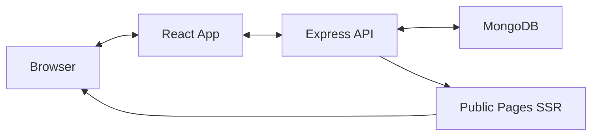

# Technical Specification

## Assumptions

### Users
- Non-technical To technial(knows HTML+CSS) recruiters as primary users
- Modern browser usage (Chrome, Firefox, Safari, Edge)

### Technical Environment
- Users have reliable internet connection
- No legacy system integrations required initially
- Mobile usage primarily for viewing, not editing

### Business Logic
- One company per user account (no multi-tenancy per user)
- Public career pages don't require authentication
- Job applications collected via simple forms
- Basic branding customization sufficient for MVP

## Architecture

### High Level


### Frontend (React)
- **Pages**: Landing, Login, Signup, Dashboard, ManageJobs, EditCareerPage
- **Components**: Reusable UI components, page builder components
- **State**: React Query for server state, local state for UI
- **Routing**: React Router with protected routes
- **Styling**: TailwindCSS with custom components

### Backend (Express)
- **Routes**: /auth, /companies, /jobs, /career-pages, /public
- **Middleware**: JWT auth, CORS, body parsing, error handling
- **Services**: Database operations, file uploads, SSR rendering
- **Security**: Password hashing, JWT tokens, input validation

### Database (MongoDB)
- **Collections**: users, companies, jobs, applications, career_pages
- **Indexes**: email (unique), company slug (unique), job queries
- **Relationships**: Referenced documents (not embedded)

## Database Schema

### Users
```javascript
{
  _id: ObjectId,
  email: String (unique),
  password: String (hashed),
  companyId: ObjectId (ref: companies),
  createdAt: Date,
  updatedAt: Date
}
```

### Companies
```javascript
{
  _id: ObjectId,
  name: String,
  slug: String (unique),
  branding: {
    primaryColor: String,
    secondaryColor: String,
    logo: String (URL)
  },
  createdAt: Date,
  updatedAt: Date
}
```

### Jobs
```javascript
{
  _id: ObjectId,
  companyId: ObjectId (ref: companies),
  title: String,
  description: String,
  location: String,
  type: String (full-time, part-time, contract),
  salary: {
    min: Number,
    max: Number,
    currency: String
  },
  requirements: [String],
  benefits: [String],
  status: String (draft, active, inactive),
  createdAt: Date,
  updatedAt: Date
}
```

### Career Pages
```javascript
{
  _id: ObjectId,
  companyId: ObjectId (ref: companies),
  components: [{
    id: String,
    type: String,
    props: Object,
    position: Number
  }],
  isPublished: Boolean,
  publishedAt: Date,
  createdAt: Date,
  updatedAt: Date
}
```

### Applications
```javascript
{
  _id: ObjectId,
  jobId: ObjectId (ref: jobs),
  email: String,
  name: String,
  phone: String,
  resume: String (URL),
  coverLetter: String,
  status: String (new, reviewed, rejected, hired),
  createdAt: Date,
  updatedAt: Date
}
```

## Test Plan

### Unit Tests
- **Frontend**: Component rendering, user interactions, form validation
- **Backend**: Route handlers, middleware, database operations
- **Utilities**: Helper functions, data transformations

### Integration Tests
- API endpoint testing with test database
- Authentication flow testing
- File upload functionality
- Database query optimization

### End-to-End Tests
- User signup and login flow
- Job creation and management
- Page builder functionality
- Public page rendering and job applications


## Deployment Strategy

### Development
- Local MongoDB or MongoDB Atlas
- Environment variables for configuration
- Hot reloading for both frontend and backend

### Production
- MongoDB Atlas for database
- Docker containers for application
- Environment-based configuration
- SSL certificates for HTTPS
- CDN for static assets
- Redis for Caching career pages
